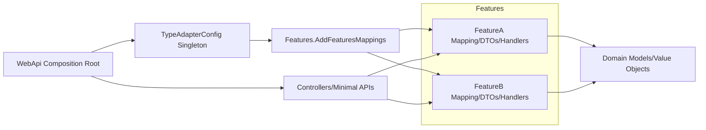

# eRents Features Reconstruction Plan

Version: 1.0  
Owner: Features Team Lead  
Last Updated: 2025-08-04

1. Purpose and Scope
This plan defines the phased refactor and standardization of eRents.Features with focus on:
- Migrating from custom mapping to Mapster across Features and WebApi composition root.
- Strengthening architecture boundaries between Domain, Features, and WebApi.
- Introducing clear rollout checkpoints, quality gates, and legacy tracking.
- Ensuring no soft-delete directives are introduced or referenced in this plan. Audit (IAuditable) remains as-is.

Out-of-scope for this plan:
- Implementing new business features not required by the migration.
- Any soft-delete behavior or ISoftDeletable abstractions.

2. Architectural Principles
- Domain purity: eRents.Domain/Models holds entities and value objects. It remains persistence- and transport-agnostic.
- Features as application services: eRents.Features contains feature-focused orchestration, use cases, DTOs, validators, and Mapster mapping registrations. No transport concerns in Features.
- WebApi as composition root: eRents.WebApi configures DI, middleware, filters, logging, exception handling, validation integration, Swagger, and Mapster TypeAdapterConfig registration shared with Features.
- Separation of concerns: Mapping, validation, error handling, and logging are consistent and centrally configured.
- Implementation focus: Plan emphasizes architectural boundaries, mapping configuration, and composition without prescribing testing strategies.
- Incremental rollout: Feature-by-feature refactor with compile/runtime validation gates.

2.1 Domain Model Location and Usage
- Authoritative domain types:
  - Entities and Value Objects: see eRents.Domain/Models
  - Shared abstractions, interfaces, enums, and common domain types: see eRents.Domain/Shared
- Prohibitions:
  - Domain must not contain mapping or transport concerns, and must not reference mapping packages (e.g., AutoMapper, Mapster). Remove such references if present in eRents.Domain/eRents.Domain.csproj.
- EF Core model ownership:
  - Owned types (e.g., Address) and entity configurations live in Domain to enable server-side projection with Mapster.
- Reference direction:
  - Features and WebApi may reference Domain. Domain does not reference Features or WebApi.

3. Migration to Mapster
3.1 Rationale
- Eliminate custom mappers to reduce boilerplate, risk, and drift.
- Improve performance and startup time compared to reflective mappers when preconfigured.
- Native projection support with EF Core through Mapster’s expressions.
- Centralized, strongly-typed configuration with TypeAdapterConfig and composable profiles.

3.2 NuGet Packages and Version Guidance
Targeting .NET 8 and EF Core 9:
- Mapster 7.4.0
- Mapster.Core 1.2.1

Constraints:
- Only Mapster 7.4.0 and Mapster.Core 1.2.1 are permitted for mapping in this plan.
- Do NOT reference Mapster.DependencyInjection or MapsterMapper packages; they are unavailable.

Notes:
- Pin versions in Directory.Packages.props or per csproj to ensure consistency.
- If EF Core projections surface issues, ensure Mapster is generating expression-safe mappings (avoid non-translatable logic in mapping lambdas).

3.3 Configuration Structure
Centralized registration and shared config:
- TypeAdapterConfig: single global instance configured in WebApi during startup.
- IServiceCollection extension: eRents.Features provides an extension to register per-feature mapping profiles against a provided TypeAdapterConfig.
- Per-feature profiles: Each feature in eRents.Features declares a static Configure method to register mappings.
- Composition root: WebApi’s Program.cs creates and configures TypeAdapterConfig and invokes Features’ registration.
- Sharing config: Inject TypeAdapterConfig where needed in Features. Use Adapt<T>(config) and ProjectToType<T>(config).

Example layout:
- eRents.Features/Core/Mapping/FeaturesMappingRegistration.cs (aggregates per-feature Configure calls)
- eRents.Features/<FeatureName>/Mapping/<FeatureName>Mapping.cs
- eRents.WebApi/Program.cs (composition root registration)

3.4 Registration Examples
Service collection extension in Features:
```csharp
// eRents.Features/Core/Mapping/FeaturesMappingRegistration.cs
using Mapster;
using Microsoft.Extensions.DependencyInjection;

namespace eRents.Features.Core.Mapping;

public static class FeaturesMappingRegistration
{
    public static IServiceCollection AddFeaturesMappings(
        this IServiceCollection services,
        TypeAdapterConfig config)
    {
        // Aggregate all feature-specific mappings here
        FeatureA.Mapping.FeatureAMapping.Configure(config);
        FeatureB.Mapping.FeatureBMapping.Configure(config);
        // Add others as they are created

        return services;
    }
}
```

Per-feature mapping profile:
```csharp
// eRents.Features/FeatureA/Mapping/FeatureAMapping.cs
using Mapster;
using eRents.Domain.Models;
using eRents.Features.FeatureA.Models;

namespace eRents.Features.FeatureA.Mapping;

public static class FeatureAMapping
{
    public static void Configure(TypeAdapterConfig config)
    {
        config.NewConfig<EntityA, EntityADto>()
              .Map(dest => dest.Id, src => src.Id)
              .Map(dest => dest.Name, src => src.Name);

        config.NewConfig<CreateEntityARequest, EntityA>()
              .Ignore(dest => dest.Id) // set by DB
              .AfterMapping((src, dest) => dest.CreatedAtUtc = DateTime.UtcNow);
    }
}
```

Composition root wiring:
```csharp
// eRents.WebApi/Program.cs (excerpt)
using Mapster;
using eRents.Features.Core.Mapping;

var builder = WebApplication.CreateBuilder(args);

// Mapster central config
var typeAdapterConfig = TypeAdapterConfig.GlobalSettings;
typeAdapterConfig.Default.PreserveReference(true);
// Additional global defaults...

// Register all Features mapping profiles
builder.Services.AddFeaturesMappings(typeAdapterConfig);

// Expose TypeAdapterConfig for injection
builder.Services.AddSingleton(typeAdapterConfig);

var app = builder.Build();
// ...
```

3.5 Common Mapping Scenarios
Entity to DTO:
```csharp
// with injected TypeAdapterConfig 'config'
var dto = entity.Adapt<EntityDto>(config);
```

DTO to Entity (create/update):
```csharp
// with injected TypeAdapterConfig 'config'
var entity = request.Adapt<Entity>(config);

// Update existing entity from DTO
request.Adapt(existingEntity, config);
```

Projection queries with EF Core:
```csharp
// using Mapster's ProjectToType for server-side projection with provided config
var list = await dbContext.Entities
    .AsNoTracking()
    .ProjectToType<EntityDto>(config)
    .ToListAsync(cancellationToken);
```

Enum <-> string conversions:
```csharp
config.NewConfig<Status, string>()
      .MapWith(src => src.ToString());

config.NewConfig<string, Status>()
      .MapWith(src => Enum.Parse<Status>(src, ignoreCase: true));
```

Flattening/nesting (Address value object to flattened DTO and back):
```csharp
// Domain
public record Address(string Country, string City, string Street, string Zip);

// DTO flattened
public sealed class CustomerDto
{
    public Guid Id { get; set; }
    public string Country { get; set; } = "";
    public string City { get; set; } = "";
    public string Street { get; set; } = "";
    public string Zip { get; set; } = "";
}

// Mapping
config.NewConfig<Customer, CustomerDto>()
      .Map(d => d.Country, s => s.Address.Country)
      .Map(d => d.City, s => s.Address.City)
      .Map(d => d.Street, s => s.Address.Street)
      .Map(d => d.Zip, s => s.Address.Zip);

config.NewConfig<CustomerDto, Customer>()
      .Map(d => d.Address, s => new Address(s.Country, s.City, s.Street, s.Zip));
```

Custom converters:
```csharp
config.ForType<DateOnly, string>()
      .MapWith(src => src.ToString("yyyy-MM-dd"));

config.ForType<string, DateOnly>()
      .MapWith(src => DateOnly.Parse(src));
```

AfterMapping hooks and conditional mappings:
```csharp
config.NewConfig<Order, OrderDto>()
      .Map(d => d.Discounted,
           s => s.DiscountPercentage.HasValue && s.DiscountPercentage > 0);
```


3.7 Migration Steps Checklist
- Inventory all custom mappers in eRents.Features and WebApi.
- Replace with Mapster adapters and profiles.
- Remove obsolete mapper classes and DI registrations.
- Register TypeAdapterConfig in WebApi Program.cs.
- Update Features to accept/inject TypeAdapterConfig where runtime adaptation is needed; prefer projection for queries.
- Validate compile-time; fix nullable annotations and owned type mappings (Address).
- Run mapping unit tests and EF Core projection tests.
- Smoke test WebApi endpoints.
- Remove AutoMapper packages and code references once parity is achieved.

4. Phase 0 Analysis
4.1 Objectives
- Inspect eRents.Features/Core for reusable components, abstractions, and duplication.
- Classify code into keep/refactor/replace/delete with clear criteria.
- Validate dependencies with eRents.Domain/Models and eRents.WebApi to prevent breakages, focusing on enums, owned types (Address), and DbContext projections.

4.2 Method
- Code scan: enumerate classes in eRents.Features/Core and each feature folder.
- Criteria:
  - Keep: aligns with new conventions, tested, no tech debt.
  - Refactor: structurally sound but needs naming, folder normalization, or dependency clean-up.
  - Replace: superseded by Mapster or Core utilities, or violates layering.
  - Delete: unused, dead code, or replaced by standardized Core components.
- Deliverable: Classification report per folder with owner and timeline.

4.3 Dependency Validation
- Domain to Features: Ensure DTOs don’t leak domain entities beyond mapping boundaries.
- Address value object: Ensure flattening/nesting mappings exist and projection works with EF Core owned types.
- Enums: Audit enum usage; ensure string conversion rules or direct enum usage is consistent.
- DbContext projections: Verify all query handlers using Select/ProjectToType are compatible.

4.4 Dependency Map Deliverable
- A diagram tying features to domain models and WebApi endpoints.
- Include input/output DTOs, validators, and mapping configuration touchpoints.

5. Refactoring Guidelines for eRents.Features
5.1 Naming and Structure
- Features follow: eRents.Features/<FeatureName> with subfolders: Commands, Queries, Models, Mapping, Validators, Services.
- Core cross-cutting concerns under eRents.Features/Core (e.g., Mapping registration, Behaviors, Validation).
- DTOs: Suffix with Dto or Request/Response where appropriate.

Repository/DbContext Access
- Query handlers: inject Domain DbContext (or Domain-defined repositories) and use Mapster projection for reads.
- Command handlers: inject Domain DbContext/repositories for writes; ensure Unit of Work/transaction boundaries are coordinated (via WebApi or pipeline behaviors).
- Keep handlers thin and application-service oriented; do not place persistence logic in WebApi controllers.

5.2 Mapping Standard
- Use Mapster exclusively for mapping.
- Prefer projection for read paths (queries).
- For commands, Adapt request -> entity and Adapt back to response DTO as needed.

Feature-to-Domain Mapping Conventions
- DTOs are defined under eRents.Features/<FeatureName>/Models and never in Domain.
- Mapping profiles under eRents.Features/<FeatureName>/Mapping reference Domain models from eRents.Domain/Models and shared types from eRents.Domain/Shared.
- Projections: Query handlers use dbContext.<DbSet>.AsNoTracking().ProjectToType<TDto>(config) for server-side mapping.
- Commands:
  - Create: request.Adapt<Entity>(config); set DB-generated fields in AfterMapping or persistence layer.
  - Update: request.Adapt(existingEntity, config) with explicit ignores for identity/audit fields.
- Mapping profiles must not depend on WebApi types; only Domain and Feature DTOs.

5.3 Validation
- Validators live in feature folders under Validators.
- WebApi integrates validation via middleware/filters; Features remain transport-agnostic.
- Do NOT use deprecated FluentValidation.AspNetCore. Register validators manually from assemblies and use a global ValidationFilter.
- Disable DataAnnotations model validation providers to avoid duplicate enforcement when using FluentValidation-only.
- Prefer returning standardized RFC 7807 Problem Details for validation errors via ASP.NET Core's ValidationProblemDetails.

5.4 Error Handling and Logging
- Consistent error model returned by WebApi.
- Use WebApi filters/middleware for exception translation and logging correlation.
- Features throw domain/application exceptions only; WebApi shapes them.

5.5 Consolidation in Core
- Consolidate reusable behaviors/utilities in eRents.Features/Core.
- Avoid duplication across features.

6. Cross-Project Considerations
6.1 Domain Audit
- Keep entities/value objects transport- and persistence-agnostic.
- Avoid mapping or DTO concerns in Domain.

6.2 WebApi Adaptation
- Controllers/minimal APIs updated to use new DTOs and Mapster mapping where needed.
- Update Swagger annotations and ensure accurate OpenAPI via Swashbuckle.
- Filters and middleware aligned with new validation and error handling.

6.3 Mapster Registration
- Single registration in WebApi Program.cs.
- TypeAdapterConfig registered as singleton and injected for Features usage.
- No MapsterMapper or ServiceMapper usage; rely on Adapt<T>(config) and ProjectToType<T>(config).

7. Implementation Plan
7.1 Phased Rollout
- Phase 0: Analysis and dependency map (Section 4).
- Phase 1: Create Mapster core module and register in WebApi; add initial per-feature mappings for 1–2 selected features.
- Phase 2+: Feature-by-feature migration:
  - Replace custom mapping, adjust DTOs, validators.
  - Update queries to use projection with ProjectToType.
  - Compile/runtime gates passed before moving to next feature.

7.2 Validation Gates per Feature
- Compile succeeds with warnings triaged.
- Swagger contract snapshot/diff shows expected changes only.

7.3 Code Quality Gates
- API contract checks: Swagger snapshot or diff in CI.
- Static analysis: nullable warnings addressed; no dead code.

7.4 Error Handling, Logging, Validation Consistency
- WebApi: global exception filter/middleware, problem details.
- Features/Core: validators invoked consistently in handlers.
- Logging: structured, correlated, and free of sensitive data.

7.5 PR Strategy and Commit Convention
- Incremental PRs per feature migration.
- Commit format: WBS-<id>: <scope>: <summary>, e.g., WBS-102: FeatureA: migrate to Mapster (7.4.0) and add projection tests.
- Each PR updates RECONSTRUCTION_LEGACY.md if legacy items are touched.

8. Legacy Code Identification and Documentation
8.1 Continuous Flagging
- During each feature refactor, flag deprecated/legacy code and document it.

8.2 Legacy Tracking Document
- New file: eRents.Features/RECONSTRUCTION_LEGACY.md
- Fields per item: Item path, Reason, Replacement path, Dependencies/Impact, Removal criteria/date.

8.3 Process
- Update the legacy document per PR.
- Add removal dates and conditions.
- Remove items only after tests and consumers are migrated.


10. Rollout Checklist
Analysis
- [ ] Inventory custom mappers across Features and WebApi
- [ ] Classify Core components (keep/refactor/replace/delete)
- [ ] Build dependency map of features, domain models, endpoints
- [ ] Audit enums, owned types (Address), and DbContext projections

Mapster Foundation
- [ ] Add Mapster 7.4.0 and Mapster.Core 1.2.1 packages in WebApi
- [ ] Create TypeAdapterConfig in Program.cs
- [ ] Implement Features AddFeaturesMappings(IServiceCollection, TypeAdapterConfig)
- [ ] Add initial global defaults (reference preservation, naming policies if needed)

Per-Feature Migration
- [ ] Create Mapping profile class per feature
- [ ] Replace custom mappers with Adapt/ProjectToType
- [ ] Update DTOs as needed (flattening/nesting rules)
- [ ] Update validators and handlers as required
- [ ] Update WebApi endpoints to use new DTOs and mapping
- [ ] Remove obsolete mapper classes and DI registrations

Quality Gates
- [ ] Compile without critical warnings; nullable addressed
- [ ] Swagger contract snapshot/diff reviewed

Cleanup and Finalization
- [ ] Remove AutoMapper and Mapster DI adapter references/packages (MapsterMapper, Mapster.DependencyInjection) if present
- [ ] Remove dead code and docs replaced by Mapster approach
- [ ] Update RECONSTRUCTION_LEGACY.md for remaining legacy items
- [ ] Tag release or milestone per phase

Domain Cleanup
- [ ] Remove mapping packages from eRents.Domain/eRents.Domain.csproj (e.g., AutoMapper) and any mapping code in Domain
- [ ] Verify owned types are configured in Domain EF model for projection readiness (e.g., Address)

11. Work Breakdown Structure (WBS) Seeds
- WBS-000: Domain purification
  - Remove mapping packages and code from Domain; ensure Domain remains persistence-/transport-agnostic
  - Validate owned type configurations in EF model for Mapster projection (e.g., Address)
- WBS-001: Establish Mapster core config in WebApi Program.cs
- WBS-002: Implement Features.AddFeaturesMappings and hook into composition root
- WBS-003: FeatureA migration (mapping, DTOs, endpoints)
- WBS-004: FeatureB migration (mapping, DTOs, endpoints)
- WBS-005: Swagger snapshot/diff CI stage
- WBS-006: Legacy tracking file creation and initial population
- WBS-007: Remove AutoMapper packages and references after parity

12. Mermaid Overview


13. Notes and Constraints
- No soft-delete directives or ISoftDeletable are part of this plan.
- IAuditable remains as-is and outside the scope of mapping concerns.
- Use ProjectToType for read-side performance and correctness where feasible.
- Keep Domain free from DTO/mapping concerns.

14. Appendices
14.1 Example IServiceCollection Extension (Alternate Form)
```csharp
// eRents.Features/Core/Mapping/ServiceCollectionExtensions.cs
using Mapster;
using Microsoft.Extensions.DependencyInjection;

namespace eRents.Features.Core.Mapping;

public static class ServiceCollectionExtensions
{
    public static IServiceCollection AddMapsterForFeatures(this IServiceCollection services)
    {
        var config = TypeAdapterConfig.GlobalSettings;
        services.AddSingleton(config);

        services.AddFeaturesMappings(config);

        return services;
    }
}
```

14.2 Troubleshooting Projection
- Owned types: ensure EF Core model config marks Address as owned; Mapster projections should reference owned members directly.
- Nullables: explicitly map default values or use AfterMapping for normalization if needed.
- Enums: standardize casing and parsing rules across APIs.

— End of Document —